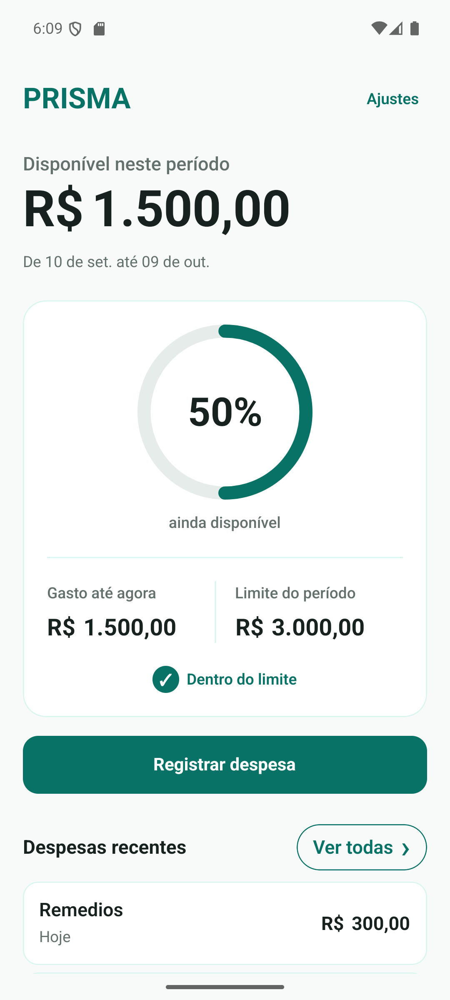
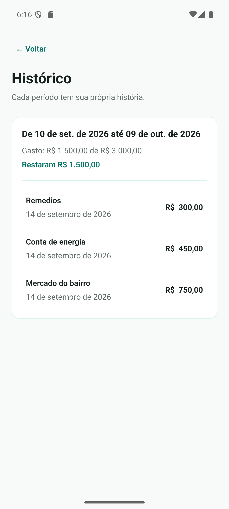
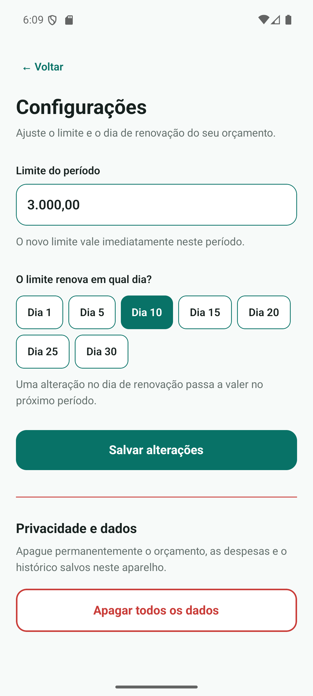
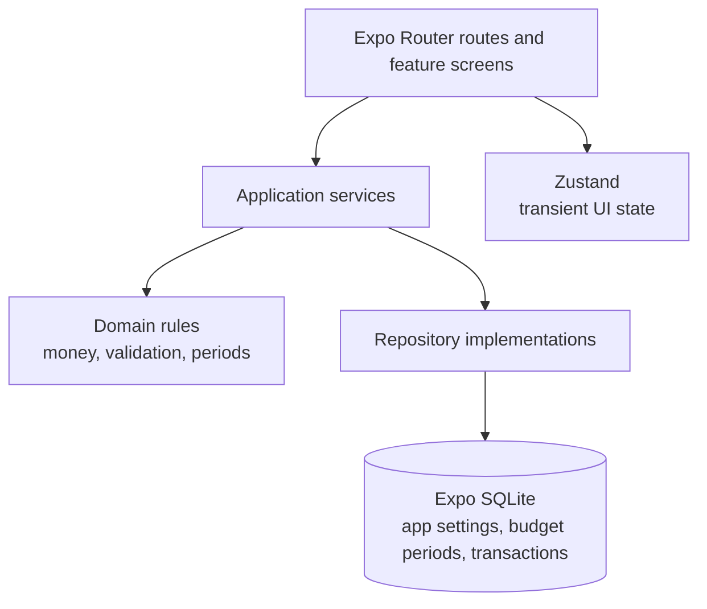

# Prisma

> An offline-first Android budget app that turns expense tracking into a deliberate, accessible daily habit.

Prisma is an Android-first personal-budget application built around a simple
idea: make every expense visible through manual entry, then clearly show how
much remains in the current budget period. It works without an account,
banking connection, analytics, or cloud dependency.

<p align="center">
  
  
  
</p>

<p align="center"><em>Standalone Android preview APK. All amounts and entries shown are fictional sample data.</em></p>

## Feature highlights

- **Deliberate expense entry:** a mandatory description encourages a brief pause before recording a purchase.
- **Period-aware budgeting:** current limits, renewal boundaries, shorter months, and historical periods follow explicit business rules.
- **Clear local history:** expenses stay grouped by the budget period in which they happened, not by calendar month.
- **Private by design:** data lives locally in SQLite; there is no login, tracking, bank integration, or cloud sync.
- **Accessible Android UI:** large-text-friendly layouts, 48dp-or-larger controls, TalkBack labels, visible feedback, and non-color-only status cues.

## Architecture



The architecture keeps business rules independent from React Native and SQLite:
screens coordinate application services, the domain owns financial and period
logic, and SQLite is the durable source of truth.

Prisma is built with:

- Expo SDK 57, React Native, Expo Router, and strict TypeScript.
- NativeWind design tokens and a minimal application shell.
- SQLite with forward-only migrations, WAL mode, and foreign keys.
- Integer-cent money model; floating-point values are never persisted.
- `app_settings`, `budget_periods`, and `transactions` tables.
- Explicit domain and repository contracts for the feature implementation phases.
- Zustand for transient application state only; SQLite remains the durable source of truth.

## Product capabilities

- Initial budget setup with a period limit and a renewal day.
- Budget periods that handle short months and renewal-day changes correctly.
- Manual expense creation, editing, and confirmed deletion.
- Dashboard remaining-budget indicator, recent expenses, and accessible status feedback.
- Budget settings: limit changes apply immediately; renewal-day changes apply in the next period.
- Expense history grouped by budget period.
- Confirmed local-data deletion that removes the budget, expenses, and history, then returns to initial setup.
- Android-first accessibility support: readable text, 48dp-or-larger controls, screen-reader headings and announcements, keyboard-aware forms, and large-text-friendly layouts.

## Local development

Prerequisites:

- Node.js 22 and pnpm 11.19.
- Android Studio with an Android emulator, or an Android device with Expo Go.

After cloning the repository, install the locked dependencies:

```bash
pnpm install --frozen-lockfile
```

Start an Android Studio emulator, then launch the Android development flow:

```bash
pnpm android
```

For a physical device, run `pnpm start` and open the project from Expo Go on
the same local network.

Other useful commands:

```bash
pnpm start
pnpm typecheck
pnpm lint
pnpm test
pnpm verify
```

## Native Android builds

Prisma uses EAS Build with two Android release-mode profiles:

- `preview` creates a signed APK for direct installation on an emulator or Android device. It is the release candidate used for standalone and cold-offline validation.
- `production` creates an AAB for a possible future Google Play release. Creating this artifact does not submit it to the store.

EAS CLI is intentionally not a project dependency. The checked-in Expo
configuration is already linked to Prisma's original EAS project. Maintainers
can authenticate on demand:

```bash
npx eas-cli@latest login
```

The `owner` and `extra.eas.projectId` values in `app.json` are public project
identifiers, not credentials. They do not grant access to the Expo account or
its signing credentials.

Portfolio evaluators do not need an Expo account or EAS Build to run Prisma
locally. Anyone creating builds from a fork must link that fork to an EAS
project they control with `npx eas-cli@latest init` and keep the resulting
owner and project-ID changes in their fork.

Inspect the resolved profile before requesting a remote build:

```bash
npx eas-cli@latest config --platform android --profile preview
npx eas-cli@latest config --platform android --profile production
```

Create an installable preview APK:

```bash
npx eas-cli@latest build --platform android --profile preview
```

On the first Android build, EAS may ask for signing credentials. Let EAS generate and manage a new Android keystore unless an existing Prisma keystore already exists. Never add a keystore or its passwords to the repository.

Only create the production AAB when a store-ready artifact is actually needed:

```bash
npx eas-cli@latest build --platform android --profile production
```

Application versions remain source-controlled in `app.json`. Increment `expo.android.versionCode` for each new production artifact that may be uploaded to Google Play, and update `expo.version` when the user-facing release version changes. Store submission is deliberately outside the current project scope.

## Verification

Run the automated baseline after dependency or schema changes:

```bash
pnpm verify
npx expo-doctor
```

`pnpm verify` runs TypeScript, lint, and Jest in the same sequence used by the
GitHub Actions workflow. `expo-doctor` is kept as a separate Expo dependency
and configuration diagnostic because it may require current Expo metadata.

Before an Android release candidate, verify these interactions on an emulator or device:

- Create, edit, and delete an expense; confirm dashboard totals and history update.
- Change the budget limit and renewal day; confirm their different effective dates are explained correctly.
- Cancel the local-data reset once, then confirm it; verify setup opens and Android Back cannot return to the deleted budget.
- Open every route using Android Back and from the dashboard controls.
- Use the numeric keyboard in setup, settings, and expense forms.
- With the app already open, temporarily disable the emulator's network; navigate between Dashboard and Settings and confirm the existing budget and expenses remain available. Re-enable networking afterwards.
- With networking available, force-stop and reopen the app; confirm the same budget, totals, and recent expenses are still present.
- Test Android font scaling at 100% and 200%, portrait and landscape, and TalkBack reading order, labels, selected states, progress, errors, and success announcements.

The included migration tests validate that pending SQLite schema migrations apply once and roll back on failure. Native SQLite behavior must still be checked on Android because Jest does not run Expo's native SQLite module.

The Phase 5 standalone Android validation is recorded in
[docs/release-validation.md](docs/release-validation.md). It documents the
scope of the tested preview APK; it does not represent a Google Play release.

## Project structure

```text
src/app/             Expo Router route shells
src/data/database/   SQLite client and schema migrations
src/domain/          Business entities, money, periods, repository contracts
src/providers/       Application bootstrap
src/shared/          Design tokens and shared UI primitives
src/state/           Transient Zustand stores
```

## Period behavior

- The first period begins on initial setup and ends at the next renewal boundary. `ends_on` is exclusive in SQLite; the interface displays the preceding day as the final included date.
- Renewal days 29-31 use the final day of shorter months.
- Limit changes update the active period immediately.
- Renewal-day changes are stored as pending and apply only when the next period begins; the current period never changes.
- The first period after a renewal-day change bridges from the old boundary to the new schedule, then later periods follow the new day.
- History is organized by budget periods rather than calendar months.
- Missing periods are created sequentially when the app resumes after one or more renewal boundaries.
- If the device clock moves behind the newest saved period, Prisma keeps the newest period active instead of rewriting or reactivating history.

## Platform scope and data handling

- Prisma is Android-first. Web is not a supported release target in this phase because Expo SQLite on web requires additional WebAssembly Metro and hosting-header configuration.
- All financial amounts are persisted as integer centavos. No floating-point monetary values are stored.
- Native Android builds disable Android automatic backup and restore (`allowBackup=false`). Prisma data therefore is not included in Android's automatic cloud-backup path.
- This choice improves privacy, but the user cannot recover Prisma data through Android backup after losing or replacing a device, or after uninstalling the app. A manual export/import capability is not yet available.
- The app has no login, synchronization, banking integration, analytics, crash-reporting SDK, or network-based transfer of financial data.
- The settings screen provides a destructive, explicitly confirmed reset that atomically clears all user-created records from the local database.
- Failed database initialization can be retried without restarting the app; failed connections are closed before a new attempt.
- Data is local, but it is not encrypted at rest. SQLCipher is intentionally deferred to a future native-build hardening phase because it is incompatible with Expo Go.
- Expo Go has its own application sandbox; this Android manifest setting takes effect in Prisma's generated native builds, not in Expo Go itself.
- After its JavaScript bundle has loaded, Prisma's budgeting and SQLite flows do not require a network connection. Expo Go remains a development client: a cold launch can require Metro to serve the development bundle. Validate a true cold-offline launch from the EAS `preview` APK before release; do not treat an Expo Go cold launch as that release check.

## License

Prisma is a source-available portfolio project, not an open-source project.
You may view, clone, build, and run it for personal evaluation, education, and
portfolio review. Redistribution, public deployment, app-store publication,
commercial use, and reuse of the project's visual identity are not permitted
without prior written permission. See [LICENSE](LICENSE) for the complete
terms. Third-party dependencies remain subject to their own licenses.
